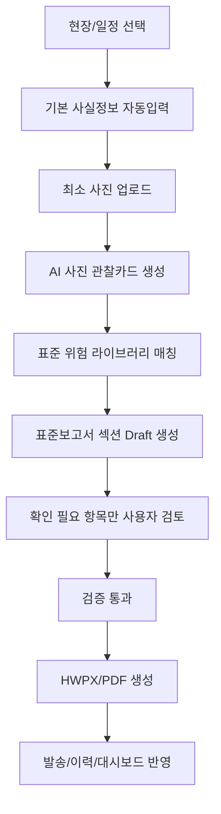

# 사진 기반 표준 기술지도 보고서 자동작성 개편안 - Index

## 목표

현재 프로젝트의 `guided_photo_flow`를 확장해서 **현장/일정 선택 + 최소 사진 2장**만으로 표준 기술지도 결과보고서 초안을 만들고, 사용자는 확인 필요한 항목만 수정한 뒤 HWPX/PDF로 발행하는 서비스를 만든다.

## 표준보고서 기준 섹션

| 표준보고서 섹션 | 자동작성 관점 | 주요 데이터 출처 |
|---|---|---|
| 1. 기술지도 대상사업장 | 사실정보 자동입력 | 현장 DB, 본사 DB, 사용자/기관 설정 |
| 2. 기술지도 개요 | 방문/회차/공정률/담당자 입력 | 일정 DB, 사용자 입력, 보고서 메타 |
| 3. 이전 기술지도 사항 이행여부 | 이전 지적사항 + 확인 사진 비교 | 이전 보고서, 현재 사진, 사용자 확정 |
| 4. 현재 공정 내 현존하는 위험성 제거 | 사진 기반 위험요인 자동작성 | 위험요인 사진, AI 관찰카드, 표준 위험 라이브러리 |
| 5. 향후 진행공정 유해·위험요인 및 대책 | 현재 공정 + 다음 공정 위험 예측 | 공정 사진, 일정/공정계획, 공정별 위험 라이브러리 |
| 6. 사업장 지원 사항 등 기타 사항 | 교육/지원 내용 자동작성 | 교육 사진, 참석인원, 위험요인, 교육자료 라이브러리 |

## 전체 흐름

## 문서 목록

1. `01_step_site_schedule_seed.md` - 현장/일정 선택 및 사실정보 자동입력
2. `02_step_minimal_photo_upload.md` - 최소 사진 업로드 구조
3. `03_step_photo_observation_card.md` - AI 사진 관찰카드 스키마
4. `04_step_risk_library_matching.md` - 표준 위험 라이브러리 매칭
5. `05_step_section_composer.md` - 표준보고서 섹션별 자동작성
6. `06_step_review_validation.md` - 사용자 검토/검증/출처관리
7. `07_step_render_export_dispatch.md` - HWPX/PDF 생성 및 발송 연동
8. `90_codex_prompts.md` - Codex 적용 프롬프트 모음

## 핵심 원칙

> 사실은 DB가 채우고, 관찰은 AI가 만들고, 문장은 표준 라이브러리가 완성하고, 최종 확정은 사용자가 한다.

## 현재 프로젝트에 맞춘 적용 방향

현재 프로젝트에는 이미 다음 흐름이 있다.

- `apps/api/app/main.py`
  - `/api/v1/reports`
  - `/api/v1/reports/{report_id}/photo-steps/step-1`
  - `/api/v1/reports/{report_id}/photo-steps/step-2`
  - `/api/v1/reports/{report_id}/draft-from-guided-photos`
  - `/api/v1/reports/{report_id}/review-complete`
  - `/api/v1/reports/{report_id}/exports/pdf`
  - `/api/v1/reports/{report_id}/exports/hwpx`
- `apps/api/app/services/ai_pipeline.py`
  - `build_draft_from_photos`
  - `build_draft_from_guided_photos`
- `apps/web/components/ReportWorkspace.tsx`
  - 1~6번 보고서 편집 UI
- `apps/web/lib/reportSessionMapper.ts`
  - SaaS 보고서 payload를 기존 inspection session으로 변환
- `apps/web/app/api/documents/inspection/hwpx/route.ts`
- `apps/web/app/api/documents/inspection/pdf/route.ts`

따라서 신규 서비스는 완전히 새로 만드는 것이 아니라, 기존 `guided_photo_flow`의 AI Draft 품질과 데이터 구조를 표준보고서 기준으로 보강하는 방식이 적합하다.
