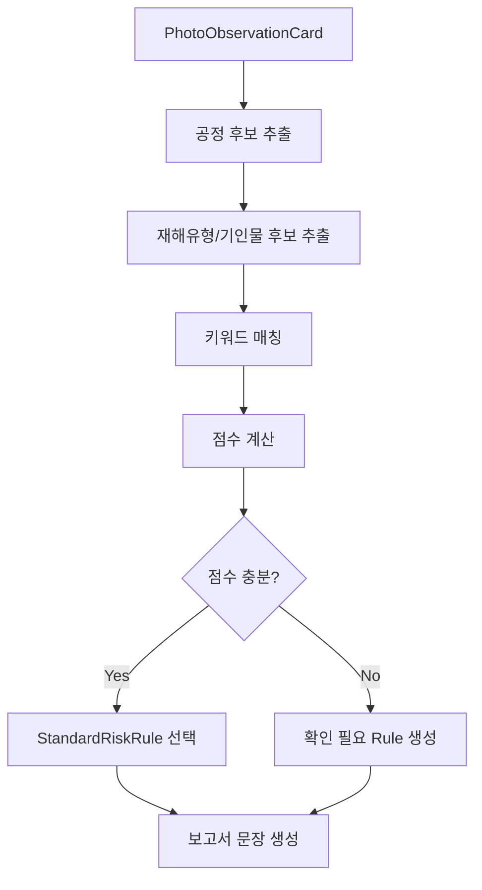

# Step 4. 표준 위험 라이브러리 매칭

## 목적

AI가 사진에서 관찰한 위험요인을 표준 위험 라이브러리에 매칭해서, 보고서 문장과 예방대책의 품질을 일정하게 만든다.

## 왜 라이브러리가 필요한가

AI가 매번 자유문장으로 지적사항을 쓰면 다음 문제가 생긴다.

- 같은 위험요인인데 문체가 달라진다.
- 법적 보고서 문장으로 적합하지 않은 표현이 나올 수 있다.
- 예방대책이 너무 일반적이거나 누락될 수 있다.
- 검증과 재사용이 어렵다.

따라서 AI는 “무슨 위험인지”를 찾고, 최종 문장은 표준 라이브러리가 만든다.

## Standard Risk Rule 스키마

```ts
type StandardRiskRule = {
  key: string;
  majorProcess:
    | '기초 및 토공사'
    | '골조공사'
    | '내부 마감공사'
    | '외부 마감공사'
    | '지붕공사'
    | '기타';
  detailProcess: string;
  accidentType: '추락' | '낙하' | '충돌' | '붕괴' | '감전' | '화재' | '협착' | '전도';
  causativeAgent: string;
  hazardKeywords: string[];
  standardHazardText: string;
  standardGuidanceText: string;
  standardCountermeasureText: string;
  defaultRiskLevel: '상' | '중' | '하';
  legalReferenceCandidates: string[];
  referenceMaterialCandidates: string[];
};
```

## 라이브러리 예시

```json
[
  {
    "key": "OPENING_FALL_COVER",
    "majorProcess": "골조공사",
    "detailProcess": "개구부 주변 작업",
    "accidentType": "추락",
    "causativeAgent": "단부 및 개구부",
    "hazardKeywords": ["개구부", "덮개", "난간", "추락"],
    "standardHazardText": "개구부 덮개 또는 안전난간 미설치로 인한 추락위험",
    "standardGuidanceText": "개구부에는 견고한 덮개를 설치하고 임의 이동을 방지할 수 있도록 고정조치 및 위험표지를 설치하실 것",
    "standardCountermeasureText": "개구부 덮개 고정, 안전난간 설치, 위험표지 부착 및 작업 전 상태 확인",
    "defaultRiskLevel": "상",
    "legalReferenceCandidates": ["산업안전보건기준에 관한 규칙"],
    "referenceMaterialCandidates": ["개구부 추락방지 안전점검표"]
  },
  {
    "key": "EXCAVATOR_COLLISION_PREVENTION",
    "majorProcess": "기초 및 토공사",
    "detailProcess": "굴착작업",
    "accidentType": "충돌",
    "causativeAgent": "굴착기",
    "hazardKeywords": ["굴착기", "작업반경", "출입통제", "신호수"],
    "standardHazardText": "굴착기 사용으로 인한 충돌 위험",
    "standardGuidanceText": "굴착기 작업반경 내 근로자 출입을 금지하고 장비 유도 및 신호수를 배치하여 충돌위험을 예방하실 것",
    "standardCountermeasureText": "작업반경 내 출입금지, 신호수 배치, 장비 이동동선 분리",
    "defaultRiskLevel": "중",
    "legalReferenceCandidates": ["산업안전보건기준에 관한 규칙"],
    "referenceMaterialCandidates": ["굴착기 작업 안전수칙"]
  }
]
```

## 매칭 알고리즘



## 매칭 결과 스키마

```ts
type RiskLibraryMatch = {
  observationId: string;
  ruleKey: string | null;
  matchScore: number;
  matchedBy: Array<'process' | 'accidentType' | 'causativeAgent' | 'keyword'>;
  standardHazardText: string;
  standardGuidanceText: string;
  standardCountermeasureText: string;
  riskLevel: '상' | '중' | '하';
  needsHumanReview: boolean;
};
```

## 현재 프로젝트 적용 포인트

새 파일을 추가한다.

```txt
apps/api/app/services/standard_risk_library.py
apps/api/app/services/standard_report_composer.py
```

`ai_pipeline.py`에서는 하드코딩 문장 대신 라이브러리 매칭 결과를 사용한다.

```py
from .standard_risk_library import match_observation_to_risk_rule
from .standard_report_composer import compose_standard_report_draft
```

## 완료 조건

- `findingCandidates[].hazardDescription`은 표준 위험 문장 또는 관찰값 기반 문장으로 들어간다.
- `findingCandidates[].improvementPlan`은 표준 지적사항 문장으로 들어간다.
- `sectionDrafts.doc8[].countermeasure`는 표준 예방대책으로 들어간다.
- 매칭 점수가 낮으면 `needsReview = true`가 된다.
