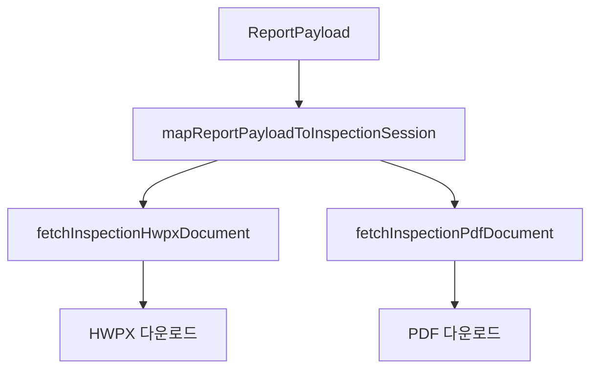

# Step 7. HWPX/PDF 생성 및 발송 연동

## 목적

검토가 끝난 표준보고서 초안을 기존 HWPX/PDF 생성 흐름에 연결하고, 향후 메일 발송/발송 이력/대시보드 갱신까지 이어지게 한다.

## 현재 프로젝트의 출력 흐름

현재 프로젝트에는 다음 흐름이 있다.



주요 파일:

```txt
apps/web/lib/reportSessionMapper.ts
apps/web/app/api/documents/inspection/hwpx/route.ts
apps/web/app/api/documents/inspection/pdf/route.ts
apps/web/components/ReportWorkspace.tsx
```

## 표준보고서 매핑

| ReportPayload | InspectionSession | 표준보고서 섹션 |
|---|---|---|
| `reportMeta` | `adminSiteSnapshot`, `document2Overview` | 1번, 2번 |
| `documentsCompat.document4FollowUps` | `document4FollowUps` | 3번 |
| `findingCandidates` | `document7Findings` | 4번 |
| `sectionDrafts.doc8` | `document8Plans` | 5번 |
| `sectionDrafts.doc11` | `document11EducationRecords` | 6번 교육 |
| `sectionDrafts.doc12` | `document12Activities` | 6번 지원 |
| `sectionDrafts.doc14` | `document14SafetyInfos` | 6번 기타 |

## 다운로드 전 조건

```ts
type ExportGate = {
  reviewCompleted: boolean;
  requiredFieldsFilled: boolean;
  aiDisclaimerAccepted: boolean;
  blockingIssues: string[];
};
```

권장 조건:

- `reviewMeta.reviewCompleted = true`
- `validationResult.valid = true` 또는 blocking issue 없음
- 최초 1회 책임 확인 완료
- HWPX/PDF 생성 전 최신 autosave 완료

## 발송 연동 구상

향후 발송까지 묶는다면 다음 API가 필요하다.

```txt
POST /api/v1/reports/{report_id}/dispatch/email
GET  /api/v1/reports/{report_id}/dispatch-history
```

요청 예시:

```json
{
  "to": ["client@example.com"],
  "cc": [],
  "subject": "2026-05-05 기술지도 결과보고서 송부",
  "body": "기술지도 결과보고서를 첨부하여 송부드립니다.",
  "attach": ["pdf", "hwpx"],
  "markReportAsSent": true
}
```

## 발송 이력 스키마

```ts
type ReportDispatchHistory = {
  id: string;
  reportId: string;
  workspaceId: string;
  channel: 'email' | 'mobile' | 'manual';
  recipients: string[];
  ccRecipients: string[];
  subject: string;
  body: string;
  attachmentFormats: Array<'pdf' | 'hwpx'>;
  status: 'queued' | 'sent' | 'failed';
  sentAt?: string;
  errorMessage?: string;
  createdAt: string;
};
```

## 대시보드 반영

보고서 상태를 다음처럼 관리한다.

```txt
draft → draft_ready → review_completed → exported → sent
```

현재 프로젝트는 `draft`, `draft_ready`, `review_completed`, `exported`가 있으므로 `sent`를 추가하면 된다.

## 완료 조건

- 검토 완료 후 HWPX/PDF 다운로드가 가능하다.
- 표준보고서 1~6번 값이 기존 문서 렌더러에 정상 매핑된다.
- 발송 기능을 추가할 경우 보고서 상태와 발송 이력이 저장된다.
- 생성/발송 후 관리자 목록과 대시보드가 갱신된다.
