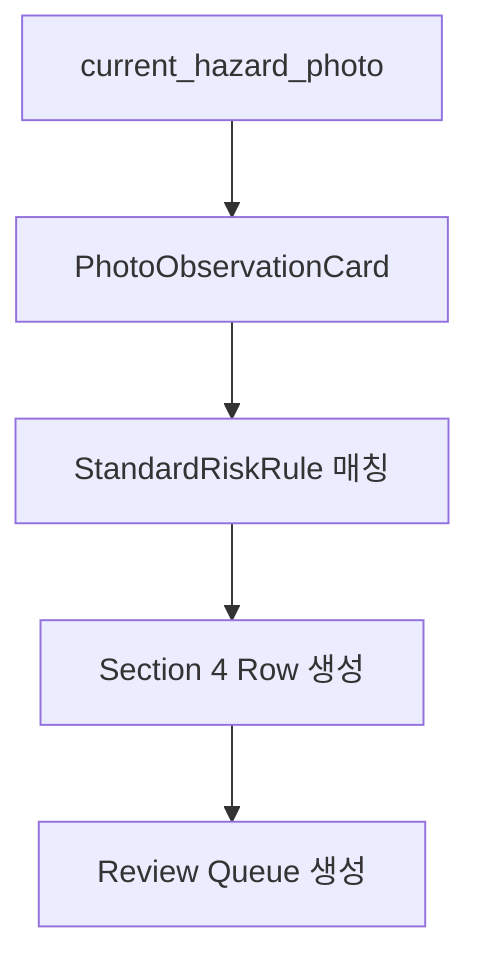
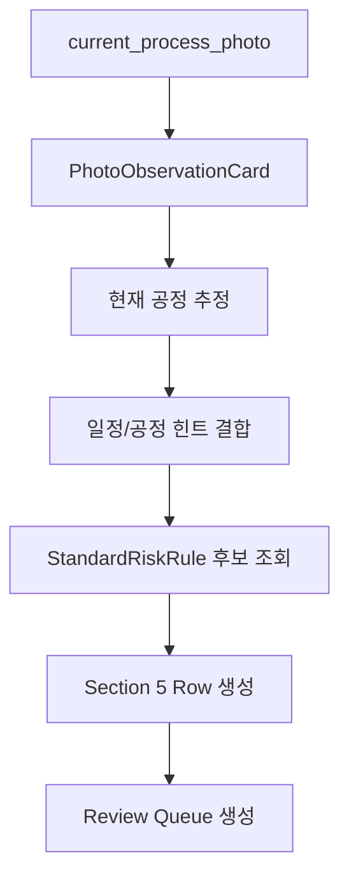

# 표준 기술지도 결과보고서 구조

이 문서는 「건설재해예방전문지도기관 기술지도 결과보고서」를 기준으로, 사진 기반 AI 자동작성 서비스에서 어떤 필드를 DB, AI, 표준 위험 라이브러리, 사용자 확인으로 채울지 정의한다.

## 자동작성 핵심 원칙

```txt
사실은 DB가 채운다.
관찰은 AI가 만든다.
문장은 표준 위험 라이브러리가 만든다.
최종 확정은 사용자가 한다.
```

## 전체 섹션

| 번호 | 섹션 | 자동작성 방식 | 핵심 출처 |
|---:|---|---|---|
| 1 | 기술지도 대상사업장 | 데이터 기반 | 현장 DB, 본사 DB, 사용자 입력 |
| 2 | 기술지도 개요 | 데이터 + 사용자 확인 | 일정 DB, 방문 데이터, 사용자 입력 |
| 3 | 이전 기술지도 사항 이행여부 | 이전 보고서 + 사진 + 사용자 확정 | 이전 보고서, 확인 사진, 사용자 확인 |
| 4 | 현재 공정 내 현존하는 위험성 제거 | AI 관찰 + 표준 위험 라이브러리 | 위험요인 사진, PhotoObservationCard, StandardRiskRule |
| 5 | 향후 진행공정에 대한 유해·위험 요인 파악 및 대책 | AI 공정 추정 + 표준 위험 라이브러리 | 공정 사진, 일정/공정 힌트, StandardRiskRule |
| 6 | 사업장 지원 사항 등 기타 사항 | 위험요인 기반 교육/지원 초안 | 교육 사진, 사용자 입력, 4번/5번 위험요인 |

---

# 1. 기술지도 대상사업장

## 목적

대상 사업장의 현장/본사 기본 정보를 기록한다.

## 필드

### 현장

| 필드 | 입력 방식 | AI 생성 여부 | 비고 |
|---|---|---:|---|
| 현장명 | DB 또는 사용자 입력 | 금지 | 사진/OCR 보조 가능하나 최종값은 DB/사용자 확정 |
| 사업장관리번호 또는 사업개시번호 | DB 또는 사용자 입력 | 금지 | 행정 식별값 |
| 공사기간 | DB 또는 사용자 입력 | 금지 | 시작일/종료일 |
| 공사금액 | DB 또는 사용자 입력 | 금지 | 숫자/금액 필드 |
| 책임자 | DB 또는 사용자 입력 | 금지 | 현장 책임자 |
| 연락처 또는 이메일 | DB 또는 사용자 입력 | 금지 | 개인정보/연락처 |
| 주소 | DB 또는 사용자 입력 | 금지 | 현장 주소 |

### 본사

| 필드 | 입력 방식 | AI 생성 여부 | 비고 |
|---|---|---:|---|
| 회사명 | DB 또는 사용자 입력 | 금지 | 본사/시공사 정보 |
| 법인등록번호 또는 사업자등록번호 | DB 또는 사용자 입력 | 금지 | 행정 식별값 |
| 면허번호 | DB 또는 사용자 입력 | 금지 | 면허 정보 |
| 연락처 | DB 또는 사용자 입력 | 금지 | 본사 연락처 |
| 주소 | DB 또는 사용자 입력 | 금지 | 본사 주소 |

## 구현 원칙

- 이 섹션은 AI가 작성하지 않는다.
- 누락된 값은 `reviewQueue`의 required 항목으로 넣는다.
- 현장 표지판 사진에서 OCR로 보조 추출할 수 있으나, 사용자가 확정하기 전에는 최종 보고서에 반영하지 않는다.

---

# 2. 기술지도 개요

## 목적

방문/회차/담당자/통보방법 등 기술지도 실시 개요를 기록한다.

## 필드

| 필드 | 입력 방식 | AI 생성 여부 | 비고 |
|---|---|---:|---|
| 지도기관명 | 조직 설정 또는 DB | 금지 | 기관 설정값 |
| 기술지도실시일 | 일정 DB 또는 사용자 입력 | 금지 | 방문일 |
| 구분 | 사용자 선택 또는 계약 유형 | 금지 | 건설 / 전기·정보통신 |
| 공정률 | 사용자 입력 또는 일정 데이터 | 금지 | 사진 기반 추정 금지 |
| 횟수 | 일정/계약 데이터 | 금지 | n회차 / 총 n회 |
| 담당 요원 | 로그인 사용자/배정 데이터 | 금지 | 담당자 식별 |
| 이전 기술지도 이행여부 | 3번 결과 요약 + 사용자 확정 | 최종값 금지 | AI는 후보 제안만 가능 |
| 연락처 | DB 또는 사용자 입력 | 금지 | 담당 요원 연락처 등 |
| 현장책임자 등 | DB 또는 사용자 입력 | 금지 | 통보 대상 |
| 통보방법 | 사용자 선택 | 금지 | 직접전달/등기우편/전자우편/모바일/기타 |
| 기타 특이사항 | 사용자 입력 또는 AI 보조 초안 | 보조 가능 | 사실을 지어내면 안 됨 |

## 구현 원칙

- 공정률은 AI가 사진으로 확정하지 않는다.
- 통보방법은 사용자 선택값을 우선한다.
- 이전 기술지도 이행여부는 3번 섹션의 사용자 확정 결과와 동기화한다.

---

# 3. 이전 기술지도 사항 이행여부

## 목적

이전 회차 지적사항이 이번 방문에서 이행되었는지 확인한다.

## 표 구조

| 필드 | 설명 | 입력 방식 |
|---|---|---|
| 지도일 또는 확인일 | 이전 지도일과 이번 확인일 | 이전 보고서 + 방문일 |
| 유해·위험장소 | 이전 지적사항의 위치 | 이전 보고서 |
| 유해·위험요인 | 이전 지적사항의 위험 내용 | 이전 보고서 |
| 지적사항 | 이전 지도 지적사항 | 이전 보고서 |
| 이행결과 | 이행 완료/불이행/부분 이행/확인 필요 | AI 후보 + 사용자 최종 확정 |

## AI 사용 방식

AI는 다음만 수행한다.

- 이전 지적사항과 현재 확인 사진의 유사성 비교
- 현재 사진에서 이행 흔적 관찰
- 이행결과 후보 제안
- 판단 근거 요약

AI는 다음을 하면 안 된다.

- 이행결과를 최종 확정
- 확인 사진이 불명확한데 이행 완료로 단정
- 이전 지적사항에 없던 행정 사실 생성

## 출력 예시

```ts
type PreviousGuidanceFollowUpDraft = {
  previousFindingId: string;
  guidanceDate?: string;
  checkDate?: string;
  hazardousPlace: string;
  hazardousFactor: string;
  previousGuidanceItem: string;
  suggestedResult: '이행 완료' | '불이행' | '부분 이행' | '확인 필요';
  finalResult?: '이행 완료' | '불이행' | '부분 이행' | '확인 필요';
  confidence: number;
  evidencePhotoIds: string[];
  needsReview: boolean;
};
```

---

# 4. 현재 공정 내 현존하는 위험성 제거

## 목적

이번 방문 시점에 현재 공정에서 확인된 현존 위험요인을 지적하고 개선 요청을 작성한다.

## 표 구조

| 필드 | 설명 | 입력 방식 |
|---|---|---|
| 유해·위험장소 | 위험이 확인된 장소 | AI 관찰 + 사용자 확인 |
| 유해·위험요인 | 사진에서 확인된 위험요인 | AI 관찰 + 표준 위험 라이브러리 |
| 지적사항 | 개선 요청 문장 | 표준 위험 라이브러리 |
| 비고 | 추후 확인/즉시 이행 가능 등 | 기본값 + 사용자 선택 |

## 생성 흐름



## 구현 원칙

- `지적사항`은 AI 자유문장으로 직접 쓰지 않는다.
- `지적사항`은 `StandardRiskRule.standardGuidanceText`에서 생성한다.
- 위험장소 confidence가 낮으면 `needsReview: true`로 둔다.
- 기본 비고는 `□ 추후 이행여부 확인 필요`로 둔다.
- 사용자가 `□ 즉시 이행가능`으로 바꿀 수 있게 한다.

## 출력 예시

```ts
type CurrentRiskRemovalRow = {
  hazardousPlace: string;
  hazardousFactor: string;
  guidanceItem: string;
  note: '□ 추후 이행여부 확인 필요' | '□ 즉시 이행가능' | string;
  evidencePhotoIds: string[];
  photoObservationIds: string[];
  standardRiskRuleId?: string;
  source: 'AI_PHOTO_AND_RISK_LIBRARY' | 'USER_INPUT' | 'DATA';
  confidence?: number;
  needsReview: boolean;
};
```

---

# 5. 향후 진행공정에 대한 유해·위험 요인 파악 및 대책

## 목적

다음 방문 전까지 예상되는 주요 진행공정과 그에 따른 유해·위험요인 및 예방대책을 작성한다.

## 주요 진행공정 분류

표준보고서의 진행공정 분류는 다음을 기본값으로 한다.

1. 기초 및 토공사
   - 터파기
   - 굴착
   - 파일항타
   - 흙막이
   - 가설공사 등
2. 골조공사
   - 철근
   - 철골
   - 거푸집·동바리 조립
   - 콘크리트 타설 등
3. 내부 마감공사
   - 미장
   - 전기배선
   - 설비배관
   - 조적작업 등
4. 외부 마감공사
   - 외벽 단열
   - 도장
   - 석재
   - 조적작업 등
5. 지붕공사
   - 지붕 설치·수리
   - 방수 등

## 유해·위험요인 분류

### 건축·구조물

- 단부 및 개구부
- 철골
- 지붕
- 비계 및 작업발판
- 사다리
- 달비계
- 이동식비계
- 거푸집 및 동바리
- 사면 및 암반
- 흙막이 지보공 등

### 기계·장비

- 굴착기
- 고소작업대
- 덤프트럭
- 화물운반트럭
- 이동식크레인
- 타워크레인
- 항타·항발기 등

### 기타

- 가스·전기용접장치
- 밀폐공간
- 전기설비 등

## 표 구조

| 필드 | 설명 | 입력 방식 |
|---|---|---|
| 다음 방문 시까지 발생하는 주요 진행공정 | 주요 공정 목록 | AI 공정 관찰 + 일정/사용자 힌트 |
| 진행공정 | 세부 공정 | 표준 공정 분류 + 위험 라이브러리 |
| 유해·위험요인 | 해당 공정의 위험요인 | 표준 위험 라이브러리 |
| 유해·위험요인을 제거하기 위한 예방대책 | 예방대책 | 표준 위험 라이브러리 |
| 비고 | 참고/확인 필요 | 기본값 + 사용자 입력 |

## 생성 흐름



## 구현 원칙

- 공정률은 AI가 생성하지 않는다.
- 다음 공정이 불명확하면 `확인 필요` 상태로 둔다.
- `예방대책`은 `StandardRiskRule.standardPreventiveMeasure`에서 생성한다.
- 자동 추천 주요 공정은 MVP에서 최대 3개로 제한한다.

## 출력 예시

```ts
type FutureProcessRiskPlan = {
  mainFutureProcesses: string[];
  rows: Array<{
    process: string;
    hazardousFactor: string;
    preventiveMeasure: string;
    note?: string;
    evidencePhotoIds: string[];
    photoObservationIds: string[];
    standardRiskRuleId?: string;
    source: 'AI_PHOTO_AND_RISK_LIBRARY' | 'USER_INPUT' | 'DATA';
    confidence?: number;
    needsReview: boolean;
  }>;
};
```

---

# 6. 사업장 지원 사항 등 기타 사항

## 목적

법적 지도 사항과 별개로 기관이 실시한 교육, 자료 보급, 기타 지원사항을 기록한다.

## 표 구조

| 필드 | 설명 | 입력 방식 |
|---|---|---|
| 지원사항 | 교육/자료보급/기타 | 사용자 선택 또는 기본값 |
| 구체적 사항 | 참석인원, 교육내용, 보급자료, 기타 | 사용자 입력 + AI 초안 |
| 비고 | 참고사항 | 사용자 입력 |

## 기본 기입 형식

```md
ㅇ 교육
ㅇ 참석인원 :
ㅇ 교육내용 :
ㅇ 보급한 교육자료
ㅇ 기타
```

## AI 사용 방식

AI는 다음을 할 수 있다.

- 4번/5번의 위험요인을 기반으로 교육내용 초안 생성
- 교육/지원 사진이 있으면 교육 주제 후보 제안
- 사진 속 교육 상황을 관찰카드로 기록

AI는 다음을 하면 안 된다.

- 참석인원 임의 생성
- 보급한 교육자료명 임의 생성
- 실제 실시하지 않은 지원사항 생성

## 출력 예시

```ts
type SupportActivityDraft = {
  supportType: '교육' | '자료보급' | '기타';
  attendeeCount?: string;
  educationContent?: string;
  providedMaterialName?: string;
  etc?: string;
  evidencePhotoIds?: string[];
  source: 'USER_INPUT' | 'AI_PHOTO' | 'SECTION_RISK_SUMMARY';
  needsReview: boolean;
};
```

---

# 필드 출처 관리

각 자동입력 필드는 출처를 기록해야 한다.

```ts
type FieldProvenance = {
  fieldPath: string;
  source: 'DATA' | 'AI_PHOTO' | 'RISK_LIBRARY' | 'USER_INPUT' | 'RULE_TEMPLATE';
  evidencePhotoIds?: string[];
  photoObservationIds?: string[];
  standardRiskRuleId?: string;
  confidence?: number;
  generatedAt?: string;
  model?: string;
  needsReview: boolean;
};
```

# 검증 규칙

렌더링 전 최소 검증:

- 1번 필수 사실정보 누락 여부
- 2번 공정률, 회차, 담당자, 통보방법 누락 여부
- 3번 이전 이행여부 최종 확정 여부
- 4번 위험장소/위험요인/지적사항 누락 여부
- 4번 지적사항이 표준 위험 라이브러리에서 왔는지 여부
- 5번 예방대책이 표준 위험 라이브러리에서 왔는지 여부
- 필수 review queue가 남아 있는지 여부

# MVP 우선순위

1. 최소 사진 2장 구조
2. PhotoObservationCard
3. StandardRiskRule 라이브러리
4. 4번 현재 위험성 제거 자동작성
5. 5번 향후 진행공정 자동작성
6. Review Queue
7. HWPX/PDF payload 매핑

