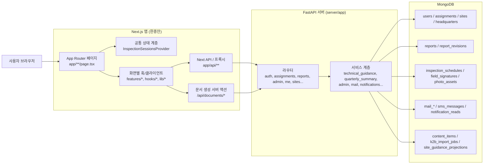
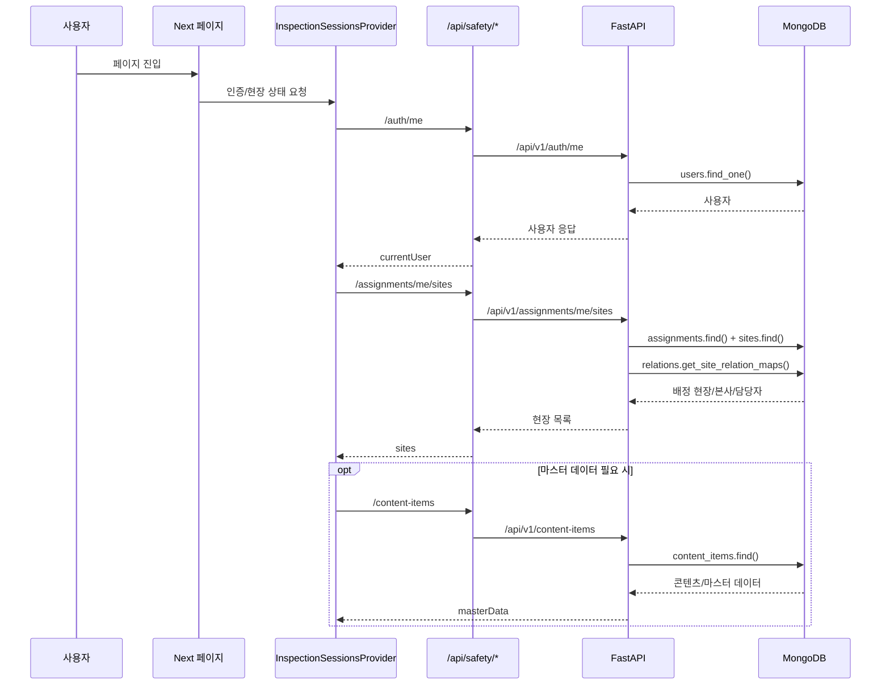
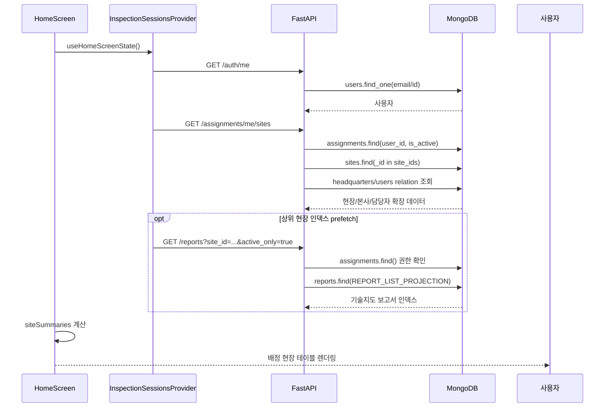
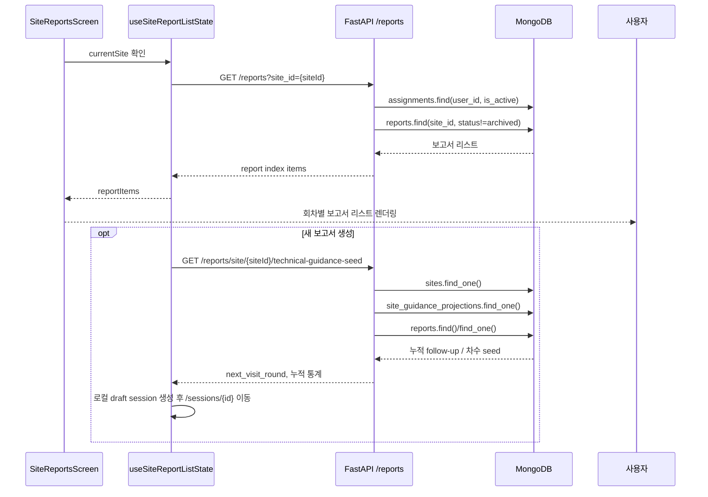
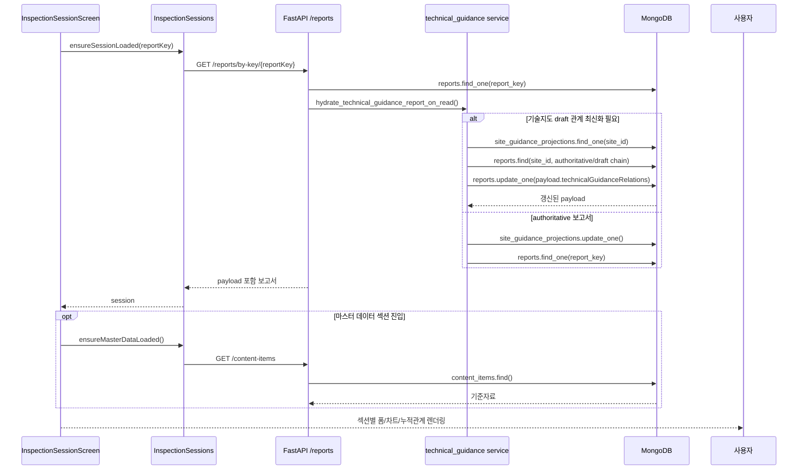
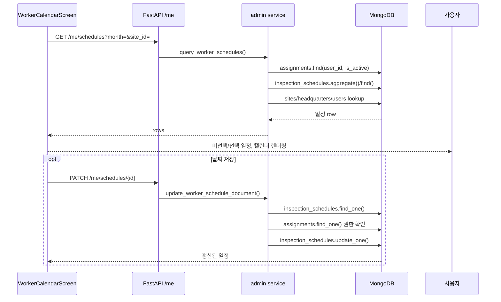
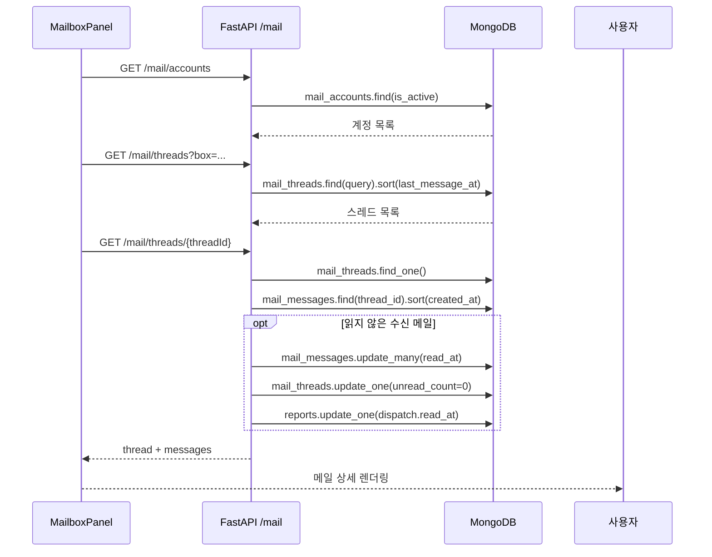

# 현재 프로젝트 시스템 아키텍처 / 연결 매핑

## 1. 한눈에 보는 전체 구조

이 프로젝트는 크게 다음 4계층으로 움직입니다.

1. `Next.js App Router` 페이지
2. 프런트 상태/클라이언트 계층(`hooks`, `lib/*`)
3. `Next app/api/*` 내부 액션 또는 `/api/safety/*` 프록시
4. `FastAPI + MongoDB` 백엔드

핵심 특징은 다음과 같습니다.

- 인증/현장/보고서 인덱스는 `InspectionSessionsProvider`가 공통으로 관리합니다.
- 일반 CRUD 데이터는 대부분 `lib/safetyApi/*`를 통해 `/api/safety/* -> FastAPI /api/v1/*`로 프록시됩니다.
- 관리자 화면 일부는 `/api/admin/*`, `/api/me/*`, `/api/mail/*`, `/api/photos/*` 같은 Next 전용 API를 별도로 사용합니다.
- 문서 생성(HWPX/PDF)은 Next 서버 내부 액션이 담당하고, PDF 변환만 별도 변환 서버/FastAPI 문서 엔드포인트를 사용할 수 있습니다.
- DB는 관계형 테이블이 아니라 MongoDB 컬렉션 기반입니다. 아래에서는 이해를 돕기 위해 `테이블(컬렉션)`으로 병기합니다.

### 전체 아키텍처 다이어그램



### 공통 데이터 부트스트랩



## 2. 페이지 라우트 -> API -> DB 연결표

### 공통 규칙

- `requestSafetyApi()` 계열 호출은 기본적으로 브라우저에서 `/api/safety/*`를 호출하고, Next가 이를 FastAPI `/api/v1/*`로 프록시합니다.
- 관리자용 `requestAdminApi()`, `requestCalendarApi()`, `requestMailApi()`, `requestMessagesApi()`, `requestNotificationsApi()`, `fetchPhotoAlbum()` 등은 Next `app/api/*` 전용 엔드포인트를 먼저 탑니다.
- `WorkerAppHeader`가 들어가는 대부분의 인증 화면은 상단 `NotificationBell`을 통해 추가로 `/api/notifications*`를 주기적으로 호출합니다.

### 라우트별 연결 요약

| 페이지 라우트 | 진입 컴포넌트 / 훅 | 호출 API / 액션 | FastAPI / Next 처리 | DB 접근 컬렉션 / 메서드 | UI 렌더링 결과 |
| --- | --- | --- | --- | --- | --- |
| `/` | `HomeScreen` -> `useHomeScreenState` -> `useInspectionSessions` | `/auth/me`, `/assignments/me/sites`, 필요 시 `/content-items`, 상단 `/notifications`, 상위 2개 현장에 대해 lazy `/reports?site_id=...` | FastAPI `auth`, `assignments`, `content`, `reports`, `notifications` | `users.find_one`, `assignments.find`, `sites.find`, `content_items.find`, `reports.find`, `notification_reads.find`, `mail_threads/find` 등 | 로그인 상태, 배정 현장 목록, 최근 작업 현황 표시 |
| `/quarterly` | `WorkerSitePickerScreen(intent='quarterly')` | `/`와 동일한 공통 부트스트랩 | 동일 | 동일 | 분기보고 대상 현장 선택 화면 |
| `/bad-workplace` | `WorkerSitePickerScreen(intent='bad-workplace')` | `/`와 동일한 공통 부트스트랩 | 동일 | 동일 | 불량작업 보고 대상 현장 선택 화면 |
| `/sites/[siteKey]/entry` | `SiteEntryHubScreen` + `SiteEntryHubPanel` | 공통 부트스트랩 + `ensureSiteReportIndexLoaded(site)` -> `/reports?site_id=...`, `useSiteOperationalReportSummary` -> `/reports?report_kind=quarterly_summary`, 상단 `/notifications` | FastAPI `reports`, `notifications` | `reports.find`, 비관리자면 `assignments.find`, 기술지도 인덱스는 `reports.find(REPORT_LIST_PROJECTION)` | 현장 홈 카드(기술지도/분기/불량작업/일정/사진/현장보조) 렌더링 |
| `/sites/[siteKey]` | `SiteReportsScreen` -> `useSiteReportListState` | `ensureSiteReportIndexLoaded(site)` -> `/reports?site_id=...`, 보고서 생성 시 `/reports/site/{siteId}/technical-guidance-seed` | FastAPI `reports` + `technical_guidance` | `assignments.find`, `reports.find`, `sites.find_one`, `site_guidance_projections.find_one`, `reports.find_one` | 기술지도 보고서 리스트, 새 보고서 생성 모달 |
| `/sessions/[sessionId]` | `InspectionSessionScreen` -> `useInspectionSessionScreen` | `ensureSessionLoaded(reportKey)` -> `/reports/by-key/{reportKey}`, 필요 시 `ensureMasterDataLoaded()` -> `/content-items`, PDF/HWPX 버튼 -> `/api/documents/inspection/*`, 이미지 업로드 -> `/api/photos/upload`, 일부 첨부는 `/content-items/assets/upload`, 상단 `/notifications` | FastAPI `reports`, `content`, `photo_assets`; Next 문서 생성 API | `reports.find_one`, `reports.update_one`, `site_guidance_projections.update_one/find_one`, `technical_guidance_recompute_jobs.*`, `content_items.find`, `photo_assets.insert_one`, `sites.find_one`, `headquarters.find_one` | 보고서 본문 상세, 섹션별 편집, 누적 지표/추적관계 반영, 문서 다운로드 |
| `/sites/[siteKey]/quarterly` | `SiteQuarterlyReportsScreen` | `useSiteOperationalReports` -> `/reports/site/{siteId}/full?report_kind=quarterly_summary,bad_workplace`, 생성 시 `/reports/site/{siteId}/quarterly-summary-seed`, 저장 시 `/reports/upsert`, 삭제 시 `/reports/by-key/{reportKey}` | FastAPI `reports` + `quarterly_summary` | `reports.find`, `reports.find_one`, `reports.insert_one/update_one`, `report_revisions.insert_one` | 분기보고서 목록, 생성/삭제, 원본 보고서 선택 준비 |
| `/sites/[siteKey]/quarterly/[quarterKey]` | 분기보고서 에디터 페이지 | 기존 보고서 조회 `/reports/by-key/{reportKey}`, seed 재계산 `/reports/site/{siteId}/quarterly-summary-seed`, 저장 `/reports/upsert`, 문서 출력 `/api/documents/quarterly/*`, 사진첩 이동 시 `/api/photos` | FastAPI `reports`; Next 문서 생성 API | `reports.find_one`, `reports.find`, `reports.insert_one/update_one`, `report_revisions.insert_one` | 분기보고서 편집, 원본 세션 집계 결과 반영, HWPX/PDF 다운로드 |
| `/sites/[siteKey]/bad-workplace/[reportMonth]` | 불량작업 보고서 에디터 | `useSiteOperationalReports` -> `/reports/site/{siteId}/full?report_kind=...`, 저장 `/reports/upsert`, 사진첩 이동 시 `/api/photos` | FastAPI `reports`; Next 사진 API | `reports.find`, `reports.insert_one/update_one`, `report_revisions.insert_one` | 월간 불량작업 보고서 편집 |
| `/calendar` | `WorkerCalendarScreen` | `/api/me/schedules`, 일정 저장 `/api/me/schedules/{id}`, 상단 `/notifications` | Next `app/api/me/*` -> FastAPI `me` -> `admin` service | `inspection_schedules.find/aggregate/update_one`, `assignments.find_one`, `sites.find_one` | 내 배정 현장 회차 일정 조회/선택 |
| `/sites/[siteKey]/assist` | `SiteAssistScreen` | `/api/photos?siteId=...`, `/api/sites/{siteId}/field-signatures`, 선택 일정 확인용 `/api/me/schedules`, 업로드 `/api/photos/upload`, 사인 저장 `POST /api/sites/{siteId}/field-signatures` | Next `photos`, `sites`, `me` API -> FastAPI `photo_assets`, `sites`, `me` | `photo_assets.aggregate/find/insert_one`, `field_signatures.find/insert_one`, `inspection_schedules.find/update_one`, `sites.find_one`, `headquarters.find_one` | 현장 최근 사진, 사인, 회차 일정, 연락처 확인 |
| `/sites/[siteKey]/photos` | `SitePhotoAlbumScreen` -> `PhotoAlbumPanel` | `/api/photos`, 선택 다운로드 `/api/photos/download`, 업로드 `/api/photos/upload`, 상단 `/notifications` | Next `photos/*` -> FastAPI `photo_assets` | `photo_assets.aggregate/count_documents/find_one/insert_one`, 조인용 `sites`, `headquarters`, 권한용 `assignments` | 사진첩 목록/필터/다운로드/업로드 |
| `/mailbox` | `MailboxScreen` -> `MailboxPanel` | `/api/mail/accounts`, `/api/mail/providers/status`, `/api/mail/threads`, `/api/mail/threads/{id}`, `/api/mail/send`, `/api/mail/sync`, 계정 연결/해제 `/api/mail/accounts/connect/*`, 상단 `/notifications` | Next `mail/*` -> FastAPI `mail` / `notifications` | `mail_accounts.find/update_one/insert_one`, `mail_oauth_states.insert_one/find_one/update_one`, `mail_threads.find/find_one/update_one/insert_one`, `mail_messages.find/find_one/insert_one/update_many`, `reports.find_one/update_one`, `notification_reads.find/update_one` | 메일 계정 관리, 스레드 목록, 상세, 발송/동기화 |
| `/mail/connect/google` | `MailConnectCallback(provider='google')` | `/api/mail/accounts/connect/google/complete` | Next `mail` API -> FastAPI `mail` | `mail_oauth_states.find_one/update_one`, `mail_accounts.find_one/update_one/insert_one` | OAuth 완료 후 `/mailbox`로 리다이렉트 |
| `/mail/connect/naver` | `MailConnectCallback(provider='naver')` | `/api/mail/accounts/connect/naver/complete` | 동일 | 동일 | OAuth 완료 후 `/mailbox`로 리다이렉트 |
| `/admin` | `AdminScreen` -> `AdminDashboardScreen` | 기본 대시보드 코어: `/users`, `/headquarters`, `/sites`, `/assignments`; 섹션별 추가 API는 아래 별도 표 참고 | 주로 `/api/safety/*` 프록시 + 일부 `/api/admin/*`, `/api/photos/*`, `/api/mail/*`, `/api/messages/*`, `/api/k2b/*` | 섹션별로 다름 | 관리자/관제 통합 대시보드 |
| `/site-overview` | `SiteOverviewPage` | `/ai/vision/causative-agents` | FastAPI `ai` | DB 직접 접근 없음 | 현장 개요 체크리스트 AI 분석 |
| `/hazard-demo` | `HazardDemoPage` | `/ai/vision/hazard-analysis` | FastAPI `ai` | DB 직접 접근 없음 | 위험성평가 초안 AI 분석 |

## 3. `/admin` 섹션별 상세 매핑

`/admin`은 한 페이지 안에서 `?section=` 값에 따라 실제 연결이 크게 달라집니다.

| 섹션 | 프런트 호출 | 서버 처리 | DB 컬렉션 / 메서드 | 비고 |
| --- | --- | --- | --- | --- |
| `headquarters` | `/headquarters`, `/sites`, `/assignments`, `/users` + CRUD | FastAPI `headquarters`, `sites`, `assignments`, `users` | `headquarters.find/insert_one/update_one`, `sites.find/insert_one/update_one`, `assignments.find/insert_one/update_one`, `users.find` | 현장 생성/수정 시 `generate_schedules_for_site()`가 같이 실행될 수 있음 |
| `users` | `/users` + 비밀번호 변경 | FastAPI `users` | `users.find/insert_one/update_one` | 사용자 비활성화 포함 |
| `content` | `/content-items`, 자산 업로드 `/content-items/assets/upload` | FastAPI `content` | `content_items.find/insert_one/update_one` | 문서 템플릿/교육자료/측정자료 관리 |
| `overview` | `/api/admin/dashboard/overview` | FastAPI `admin.build_admin_overview()` | `users.find`, `sites.find`, `assignments.find`, `headquarters.find`, `reports.find`, `inspection_schedules.find`, 추가 집계 | 관제 카드/알림/마감/누락 현황 |
| `analytics` | `/api/admin/dashboard/analytics` | FastAPI `admin.build_admin_analytics()` | `users.find`, `sites.find`, `assignments.find`, `headquarters.find`, `reports.find` | 실적/매출/기간별 지표 |
| `reports` | `/api/admin/reports`, `/api/admin/reports/{key}/review`, `/dispatch`, `/dispatch-events`, `/api/messages/providers/status`, `/api/messages/sms/send` | FastAPI `admin`, `messages` | `reports.find/count_documents/update_one`, `sites.find`, `headquarters.find`, `assignments.find`, `users.find`, `sms_messages.insert_one` | 보고서 검수/발송 메타 관리, SMS 발송 |
| `photos` | `/api/photos`, `/api/photos/upload`, `/api/photos/download` | Next `photos` -> FastAPI `photo_assets` | `photo_assets.aggregate/find/insert_one`, `sites.find`, `headquarters.find`, `assignments.find` | 관리자 전체 사진첩 |
| `mailbox` | `/api/mail/*` | FastAPI `mail` | `mail_accounts`, `mail_oauth_states`, `mail_threads`, `mail_messages`, `reports` | 공용/개인 메일함 통합 |
| `schedules` | `/api/admin/schedules`, `/api/admin/sites/{siteId}/schedules/generate`, `/api/admin/schedules/{id}` | FastAPI `admin.query_admin_schedules()`, `generate_schedules_for_site()`, `update_schedule_document()` | `inspection_schedules.aggregate/find/update_one`, `sites.find`, `headquarters.find`, `assignments.find`, `users.find` | 회차 일정 조회/생성/예외 수정 |
| `reports` 또는 `headquarters` 내부 K2B 모달 | `/api/k2b/imports/parse`, `/api/k2b/imports/{jobId}`, `/api/k2b/imports/apply` | Next 로컬 K2B 처리 + FastAPI `k2b` | `k2b_import_jobs.insert_one/find_one`, 적용 시 `headquarters.find/update_one/insert_one`, `sites.find/update_one/insert_one` | 엑셀 기반 초기 데이터 반영 |

## 4. DB 테이블(컬렉션) / 쿼리 메서드 매핑

### 핵심 도메인 컬렉션

| 컬렉션 | 주 용도 | 대표 진입 라우터/서비스 | 실제 쿼리 메서드 |
| --- | --- | --- | --- |
| `users` | 로그인 계정, 역할, 담당자 정보 | `auth`, `users`, `admin`, `assignments`, `sites` | `find`, `find_one`, `insert_one`, `update_one`, `count_documents` |
| `headquarters` | 본사/사업장 상위 엔티티 | `headquarters`, `sites`, `admin`, `k2b`, `photo_assets` | `find`, `find_one`, `insert_one`, `update_one` |
| `sites` | 현장 기본 정보 | `assignments`, `sites`, `reports`, `admin`, `photo_assets`, `k2b` | `find`, `find_one`, `insert_one`, `update_one` |
| `assignments` | 사용자-현장 매핑 | `assignments`, `sites`, `reports`, `admin`, `me`, `photo_assets` | `find`, `find_one`, `insert_one`, `update_one` |
| `reports` | 최신 보고서 본문/메타 | `reports`, `admin`, `mail`, `messages`, `notifications`, `technical_guidance`, `quarterly_summary` | `find`, `find_one`, `insert_one`, `update_one`, `count_documents` |
| `report_revisions` | 보고서 리비전 이력 | `reports.add_report_revision()` | `find`, `insert_one` |
| `content_items` | 교육자료/측정자료/콘텐츠 마스터 | `content`, `InspectionSessionsProvider`, `admin` | `find`, `find_one`, `insert_one`, `update_one` |

### 운영/부가 기능 컬렉션

| 컬렉션 | 주 용도 | 대표 진입 라우터/서비스 | 실제 쿼리 메서드 |
| --- | --- | --- | --- |
| `inspection_schedules` | 회차별 방문 일정 | `me`, `admin`, `sites(create/update)` | `find`, `find_one`, `aggregate`, `update_one`, `count_documents` |
| `field_signatures` | 현장 서명 | `sites/{siteId}/field-signatures` | `find`, `insert_one` |
| `photo_assets` | 업로드/legacy 사진 메타데이터 | `photo_assets`, `photo_assets.backfill_legacy_photo_assets()` | `aggregate`, `find`, `find_one`, `insert_one`, `count_documents` |
| `mail_accounts` | 메일 계정 연결 상태 | `mail` | `find`, `find_one`, `insert_one`, `update_one`, `update_many` |
| `mail_oauth_states` | OAuth state 저장 | `mail` | `insert_one`, `find_one`, `update_one` |
| `mail_threads` | 메일 스레드 | `mail`, `notifications` | `find`, `find_one`, `insert_one`, `update_one`, `count_documents` |
| `mail_messages` | 메일 메시지 | `mail`, `notifications` | `find`, `find_one`, `insert_one`, `update_many`, `count_documents` |
| `sms_messages` | 문자 발송 로그 | `messages` | `insert_one` |
| `notification_reads` | 알림 읽음 여부 | `notifications` | `find`, `update_one` |
| `k2b_import_jobs` | K2B 파싱 작업 임시 결과 | `k2b` | `insert_one`, `find_one` |
| `site_guidance_projections` | 기술지도 누적 투영 상태 | `technical_guidance` | `find_one`, `update_one` |
| `technical_guidance_recompute_jobs` | 기술지도 재계산 작업 | `technical_guidance` | `find_one`, `insert_one`, `find_one_and_update`, `update_one` |

## 5. 대표 페이지 진입 시 데이터 흐름

### 5-1. 홈(`/`) 진입



### 5-2. 기술지도 보고서 목록(`/sites/[siteKey]`) 진입



### 5-3. 보고서 상세(`/sessions/[sessionId]`) 진입



### 5-4. 분기보고서 편집(`/sites/[siteKey]/quarterly/[quarterKey]`) 진입

```mermaid
sequenceDiagram
    participant UI as Quarterly Page
    participant API as FastAPI /reports
    participant QS as quarterly_summary service
    participant DB as MongoDB

    UI->>API: GET /reports/by-key/{quarterKey}
    API->>DB: reports.find_one(report_key)
    DB-->>API: 기존 분기보고서 또는 404

    opt 새 계산 또는 재계산
        UI->>API: GET /reports/site/{siteId}/quarterly-summary-seed
        API->>QS: build_quarterly_summary_seed()
        QS->>DB: reports.find(site_id) ; 기술지도 원본 선별
        QS->>QS: 기간 필터, 사고/기인물 통계, 이행현황 계산
        QS-->>UI: implementation_rows, stats, future_plans
    end

    UI-->>사용자: 기간/원본 세션 반영된 분기보고서 편집 화면 렌더링
```

### 5-5. 일정(`/calendar`) 진입



### 5-6. 사진첩(`/sites/[siteKey]/photos`, `/admin?section=photos`) 진입

```mermaid
sequenceDiagram
    participant UI as PhotoAlbumPanel
    participant API as FastAPI /photo-assets
    participant DB as MongoDB

    UI->>API: GET /photo-assets?...filters...
    API->>DB: assignments.find() ; 권한 site_id 범위 확인
    API->>DB: photo_assets.aggregate([
        $match, $lookup sites, $lookup headquarters, $sort
    ])
    DB-->>API: 사진 메타데이터
    API-->>UI: rows, total
    UI-->>사용자: 사진 카드/테이블 렌더링

    opt 업로드
        UI->>API: POST /photo-assets/upload
        API->>DB: sites.find_one()
        API->>DB: headquarters.find_one()
        API->>DB: photo_assets.insert_one()
        API-->>UI: 새 사진 row
    end
```

### 5-7. 메일함(`/mailbox`, `/admin?section=mailbox`) 진입



## 6. 테스트/검증 포인트

전체 연결 확인용으로는 아래 순서가 가장 효율적입니다.

1. 홈(`/`)에서 로그인 후 현장 목록이 보이는지 확인
2. 특정 현장 `/sites/[siteKey]`에서 기술지도 보고서 인덱스가 로드되는지 확인
3. 새 보고서 생성 시 `/reports/site/{siteId}/technical-guidance-seed`가 정상 응답하는지 확인
4. `/sessions/[sessionId]`에서 본문이 로드되고, 새로고침 후에도 `/reports/by-key/{reportKey}`로 복원되는지 확인
5. `/calendar`에서 일정 저장 시 `inspection_schedules`가 업데이트되는지 확인
6. `/sites/[siteKey]/photos`에서 업로드 후 즉시 목록에 반영되는지 확인
7. `/sites/[siteKey]/assist`에서 사인 저장 후 `field_signatures` 최신 1건이 보이는지 확인
8. `/sites/[siteKey]/quarterly` 및 상세 페이지에서 seed 계산 결과가 기술지도 보고서 수와 맞는지 확인
9. `/mailbox` 또는 `/admin?section=mailbox`에서 계정/스레드/상세 흐름이 이어지는지 확인
10. `/admin` 각 섹션에서 필터/수정 후 실제 컬렉션 변경이 반영되는지 확인

## 7. 핵심 코드 기준 위치

- 공통 부트스트랩: `hooks/inspectionSessions/provider.tsx`, `hooks/inspectionSessions/sync.ts`
- 안전 API 프록시: `app/api/safety/[...path]/route.ts`, `lib/safetyApi/proxy.ts`
- 홈/현장 진입: `features/home/*`, `features/site-reports/*`
- 보고서 상세: `features/inspection-session/hooks/useInspectionSessionScreen.ts`
- 관리자 대시보드: `features/admin/hooks/useAdminDashboardState.ts`, `server/app/services/admin.py`
- 기술지도 누적관계: `server/app/services/technical_guidance.py`
- 분기 seed 계산: `server/app/services/quarterly_summary.py`
- 메일함: `features/mailbox/components/MailboxPanel.tsx`, `server/app/services/mail.py`
- 사진첩: `features/photos/components/PhotoAlbumPanel.tsx`, `server/app/routers/photo_assets.py`

